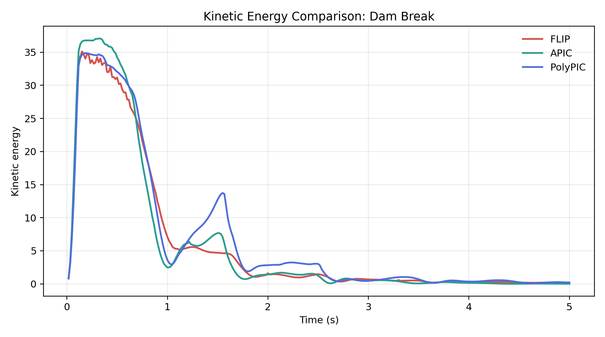
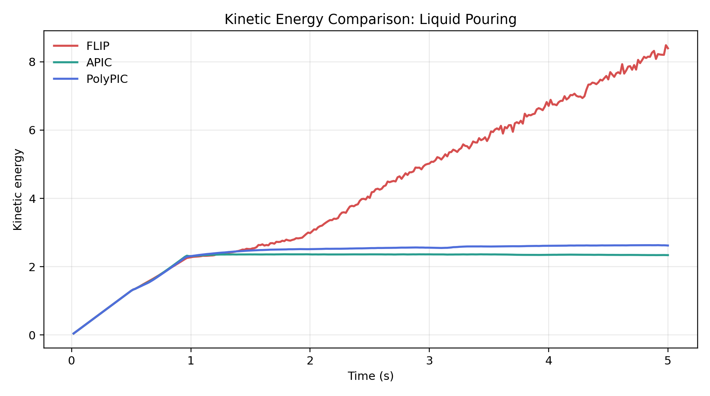
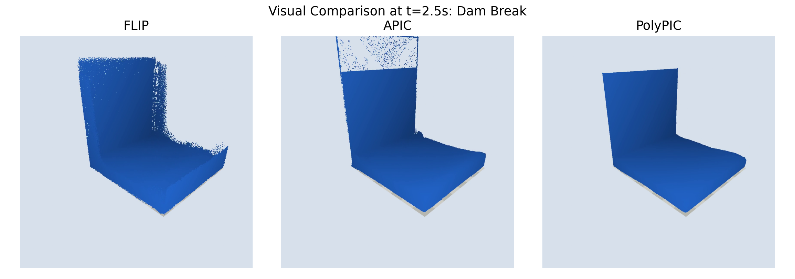
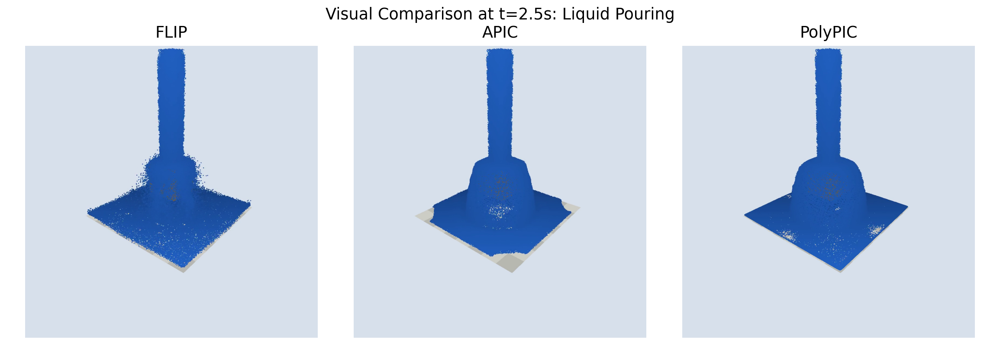

# Comparative Study of FLIP, APIC, and PolyPIC Transfers for Particle-Grid Fluid Simulation

## Abstract

This report presents an Option 1 experimental validation project for CS3511: Physical Simulation of Solids and Fluids. We compare three particle-grid transfer schemes, FLIP, APIC, and PolyPIC, under a shared Taichi-based simulation framework. The experiments use identical grid resolution, boundary handling, particle generation, rendering style, and two scene configurations: a 3D dam break and a liquid pouring setup. The comparison focuses on kinetic-energy evolution, qualitative visual behavior, and reproducibility of generated artifacts.

## Course Option and Scope

The course logistics slides define Option 1 as experimental validation of existing simulators. The same slides specify that the final report should contain introduction, related work, methods, results, and discussion. This project follows that structure. Open-source and AI-assisted implementation were used with explicit acknowledgement in the appendix.

The project contribution is not a new fluid model. Instead, it is a controlled comparison pipeline: three transfer schemes are implemented or run from a common framework, their outputs are converted into consistent CSV traces and videos, and the resulting behavior is summarized quantitatively and visually.

## Related Work

The FLIP method was introduced by Brackbill and Ruppel as a low-dissipation particle-in-cell variant for fluid-flow calculation. APIC was later proposed by Jiang et al. to improve particle-grid transfers by carrying locally affine velocity information. PolyPIC generalizes this direction by representing a more general local polynomial function on each particle. Our implementation-level comparison follows the same conceptual ladder: constant particle velocity transfer, affine transfer, and higher-order polynomial transfer.

## Methods

All algorithms were evaluated using the shared 3D grid framework in `framework.py`. The main experimental parameters were fixed across methods: grid resolution `80 x 100 x 80`, cell size `DX = 0.01`, two substeps per rendered frame, 300 output frames, and `ratio_970` for the FLIP/PIC blend convention. The two scenes are:

- `dam_break`: a dense water block initialized near one side of the domain.
- `liquid_pouring`: a source-like initialization producing an incoming stream.

FLIP uses an incremental grid velocity update to reduce dissipation relative to pure PIC. APIC augments particle state with a local affine velocity matrix, allowing first-order velocity variation to survive particle-grid transfers. PolyPIC extends this idea with higher-order local polynomial information, aiming to preserve richer local flow structure during transfers.

## Results: Dam Break

| Algorithm | Rows | Finite | Initial E | Peak E | Final E | Energy AUC | Mean ms/frame* |
|---|---:|:---:|---:|---:|---:|---:|---:|
| FLIP | 300 | True | 0.8193 | 35.1273 | 0.2105 | 30.2746 | 12822.687 |
| APIC | 300 | True | 0.8333 | 37.0836 | 0.0178 | 30.2771 | 35.130 |
| PolyPIC | 300 | True | 0.8074 | 34.8671 | 0.2117 | 34.1077 | 42.894 |

*The first frame includes initialization and compilation overhead, so the timing column excludes frame 0.*

In the dam-break scene, all three methods remain finite for the full 300-frame run. PolyPIC has the largest integrated kinetic energy, suggesting the least overall dissipation in this test. APIC reaches the highest peak energy but, because the APIC branch was stabilized with finite-value guards and affine damping, it dissipates more strongly near the end of the run.

## Results: Liquid Pouring

| Algorithm | Rows | Finite | Initial E | Peak E | Final E | Energy AUC | Mean ms/frame* |
|---|---:|:---:|---:|---:|---:|---:|---:|
| FLIP | 300 | True | 0.0432 | 8.4851 | 8.3959 | 21.2332 | 1811.240 |
| APIC | 300 | True | 0.0432 | 2.3630 | 2.3384 | 10.6397 | 13.860 |
| PolyPIC | 300 | True | 0.0432 | 2.6302 | 2.6197 | 11.4223 | 14.951 |

In the liquid-pouring scene, FLIP produces substantially higher kinetic energy than APIC and PolyPIC. This should not be interpreted as strictly better energy preservation. In a forced pouring setup, high kinetic energy can also reflect transfer noise or excessive momentum retention. APIC and PolyPIC give lower and smoother energy curves, with PolyPIC slightly above APIC in both peak and integrated energy.

## Visual Comparison

The video outputs are stored with the corresponding algorithm results. The screenshots above were extracted at `t = 2.5s` from the committed MP4 files.

## Discussion

The experiments support three practical observations. First, a shared framework is necessary: small changes in grid resolution, particle count, or boundary treatment can dominate the numerical differences between transfer schemes. Second, kinetic energy is informative but not sufficient on its own. Higher energy can mean useful reduced dissipation, but it can also expose noisy transfer or excessive momentum retention. Third, APIC and PolyPIC require more care than baseline FLIP. APIC in particular needed affine-matrix limiting to avoid NaN growth in the full run.

For the dam-break case, PolyPIC gives the clearest energy-retention advantage by integrated kinetic energy. For the pouring case, APIC and PolyPIC are more restrained than FLIP; PolyPIC retains slightly more energy than APIC while remaining stable. These results are consistent with the motivation behind affine and polynomial particle-grid transfers: additional local velocity information can improve transfer quality, but stability controls remain important in a compact course implementation.

## Limitations

The comparison is a course-scale validation rather than a full benchmark. The rendering is particle-based and not a high-quality surface reconstruction. Timing is reported but should be treated cautiously because the FLIP data were produced in a different run context from the APIC/PolyPIC reruns. The APIC implementation also includes damping for robustness, which changes its energy behavior relative to an ideal APIC formulation.

## Conclusion

The final pipeline successfully produces reproducible outputs for FLIP, APIC, and PolyPIC under common scenes. PolyPIC shows the strongest energy retention in the dam-break test, while APIC and PolyPIC show smoother, lower-energy behavior in the pouring scene than the baseline FLIP run. The project therefore satisfies the Option 1 goal: experimental validation and comparison of existing simulator techniques through controlled runs, quantitative plots, videos, and a documented analysis pipeline.

## Artifact Index

- `output/comparison/energy_summary.csv`
- `output/comparison/dam_break_energy_timeseries.csv`
- `output/comparison/liquid_pouring_energy_timeseries.csv`
- `output/comparison/dam_break_kinetic_energy.png`
- `output/comparison/liquid_pouring_kinetic_energy.png`
- `output/comparison/energy_auc_summary.png`
- `docs/final_report/option1_comparative_study.pdf`
- `docs/final_report/option1_comparative_study.md`

## References

1. J. U. Brackbill and H. M. Ruppel. FLIP: A method for adaptively zoned, particle-in-cell calculations of fluid flows in two dimensions. Journal of Computational Physics 65(2), 314-343, 1986. DOI: <https://doi.org/10.1016/0021-9991(86)90211-1>.
2. C. Jiang, C. Schroeder, A. Selle, J. Teran, and A. Stomakhin. The Affine Particle-In-Cell Method. ACM Transactions on Graphics, 2015. Paper: <https://mass.math.ucdavis.edu/~jteran/papers/JSSTS15.pdf>.
3. C. Fu, Q. Guo, T. Gast, C. Jiang, and J. Teran. A Polynomial Particle-In-Cell Method. ACM Transactions on Graphics 36(6), Article 222, 2017. DOI: <https://doi.org/10.1145/3130800.3130878>.
4. R. Bridson. Fluid Simulation for Computer Graphics. A K Peters/CRC Press.

## Appendix: AI Tool Usage

AI tools were used to assist with code repair, Slurm job orchestration, data plotting, and drafting this report. The numerical results were not generated by language-model text; they were computed by running the repository code and were verified from the committed CSV files. The final interpretation was checked against the actual outputs, including finite-value validation for all 300-frame APIC and PolyPIC runs.
