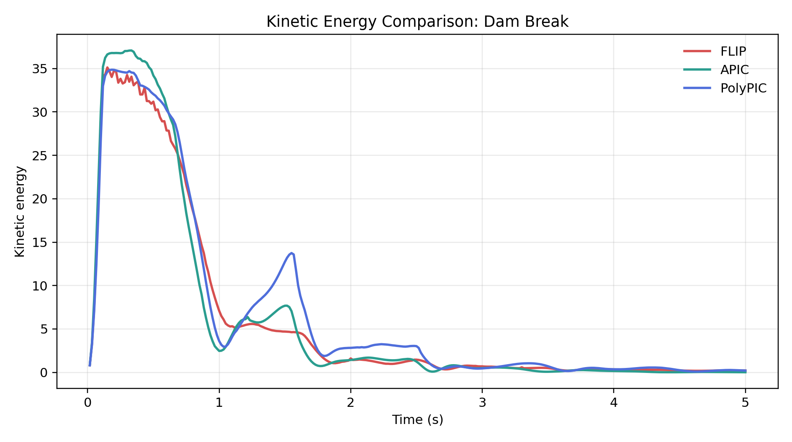
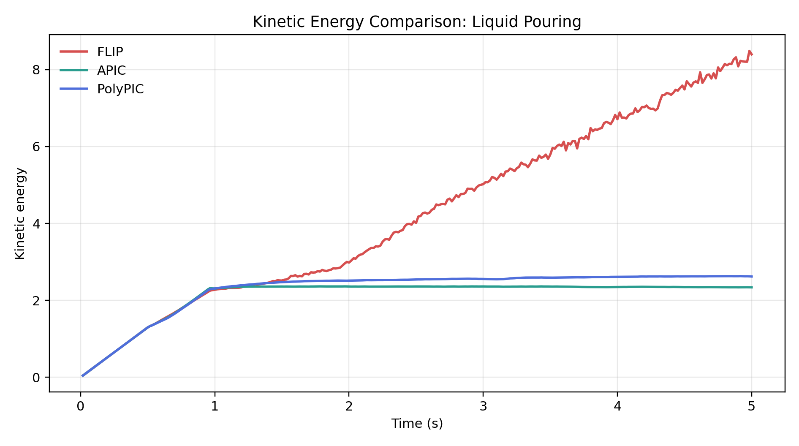
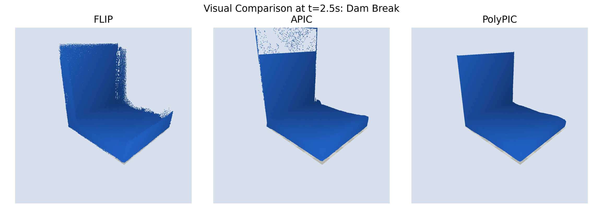
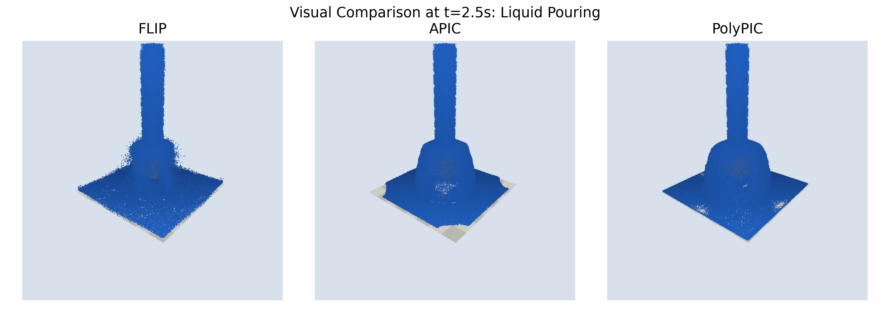
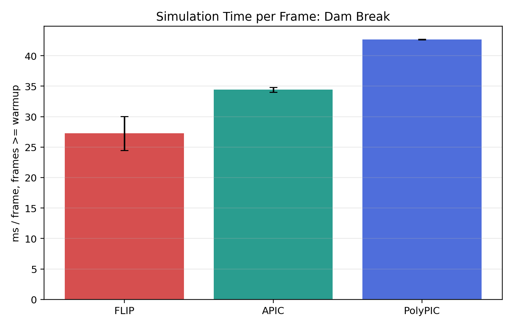
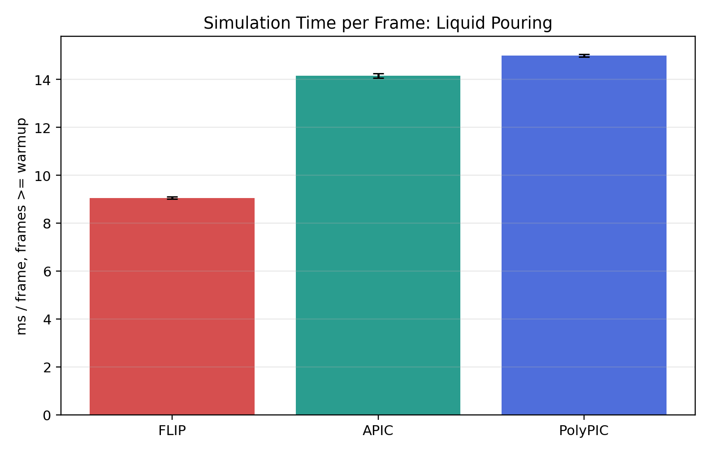
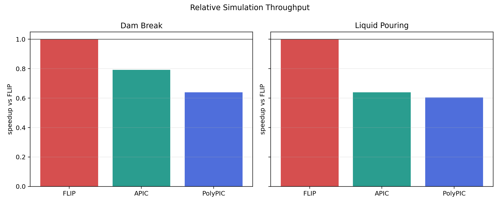

# Comparative Study of FLIP, APIC, and PolyPIC Transfers for Particle-Grid Fluid Simulation

## Abstract

This report compares three particle-grid transfer schemes, FLIP, APIC, and PolyPIC, under a shared Taichi-based simulation framework. The experiments use identical grid resolution, boundary handling, particle generation, rendering style, and two scene configurations: a 3D dam break and a liquid pouring setup. The comparison focuses on kinetic-energy evolution, qualitative visual behavior, and a controlled runtime benchmark.

## Scope

This study is an experimental validation rather than a new fluid model. The goal is to isolate the transfer scheme as much as possible.

The contribution is a controlled comparison pipeline: three transfer schemes are implemented or run from a common framework, their outputs are converted into consistent CSV traces and videos, and the resulting behavior is summarized quantitatively and visually.

## Related Work

The FLIP method was introduced by Brackbill and Ruppel as a low-dissipation particle-in-cell variant for fluid-flow calculation. APIC was later proposed by Jiang et al. to improve particle-grid transfers by carrying locally affine velocity information. PolyPIC generalizes this direction by representing a more general local polynomial function on each particle. Our implementation-level comparison follows the same conceptual ladder: constant particle velocity transfer, affine transfer, and higher-order polynomial transfer.

## Methods

All algorithms were evaluated using the shared 3D grid framework in `framework.py`. The main experimental parameters were fixed across methods: grid resolution `80 x 100 x 80`, cell size `DX = 0.01`, two substeps per rendered frame, 300 output frames, and `ratio_970` for the FLIP/PIC blend convention. The two scenes are:

- `dam_break`: a dense water block initialized near one side of the domain.
- `liquid_pouring`: a source-like initialization producing an incoming stream.

FLIP uses an incremental grid velocity update to reduce dissipation relative to pure PIC. APIC augments particle state with a local affine velocity matrix, allowing first-order velocity variation to survive particle-grid transfers. PolyPIC extends this idea with higher-order local polynomial information, aiming to preserve richer local flow structure during transfers.

Efficiency was benchmarked separately from the rendered runs. FLIP, APIC, and PolyPIC were evaluated in a single batch benchmark on the `rtxp6000` partition with one NVIDIA RTX PRO 6000 Blackwell Server Edition GPU, 8 CPU cores, and 64 GB host memory. Taichi CUDA was enabled with `TI_ARCH=cuda`. Rendering and video export were disabled, each method-scene pair was measured for three repetitions, and the first five frames were discarded to reduce JIT and initialization effects.

## Results: Dam Break

| Algorithm | Rows | Finite | Initial E | Peak E | Final E | Energy AUC |
|---|---:|:---:|---:|---:|---:|---:|
| FLIP | 300 | True | 0.8193 | 35.1273 | 0.2105 | 30.2746 |
| APIC | 300 | True | 0.8333 | 37.0836 | 0.0178 | 30.2771 |
| PolyPIC | 300 | True | 0.8074 | 34.8671 | 0.2117 | 34.1077 |

In the dam-break scene, all three methods remain finite for the full 300-frame run. PolyPIC has the largest integrated kinetic energy, suggesting the least overall dissipation in this test. APIC reaches the highest peak energy but, because the APIC branch was stabilized with finite-value guards and affine damping, it dissipates more strongly near the end of the run.

## Results: Liquid Pouring

| Algorithm | Rows | Finite | Initial E | Peak E | Final E | Energy AUC |
|---|---:|:---:|---:|---:|---:|---:|
| FLIP | 300 | True | 0.0432 | 8.4851 | 8.3959 | 21.2332 |
| APIC | 300 | True | 0.0432 | 2.3630 | 2.3384 | 10.6397 |
| PolyPIC | 300 | True | 0.0432 | 2.6302 | 2.6197 | 11.4223 |

In the liquid-pouring scene, FLIP produces substantially higher kinetic energy than APIC and PolyPIC. This should not be interpreted as strictly better energy preservation. In a forced pouring setup, high kinetic energy can also reflect transfer noise or excessive momentum retention. APIC and PolyPIC give lower and smoother energy curves, with PolyPIC slightly above APIC in both peak and integrated energy.

## Visual Comparison

The video outputs are stored with the corresponding algorithm results. The screenshots above were extracted at `t = 2.5s` from the committed MP4 files.

## Efficiency Benchmark

| Scene | Algorithm | Reps | Mean ms/frame | Std | Median | P95 | M particles/s | Speedup vs FLIP |
|---|---|---:|---:|---:|---:|---:|---:|---:|
| Dam Break | FLIP | 3 | 27.246 | 2.777 | 28.465 | 35.070 | 75.91 | 1.00x |
| Dam Break | APIC | 3 | 34.417 | 0.386 | 34.643 | 45.385 | 59.67 | 0.79x |
| Dam Break | PolyPIC | 3 | 42.639 | 0.055 | 39.852 | 57.272 | 48.16 | 0.64x |
| Liquid Pouring | FLIP | 3 | 9.053 | 0.046 | 7.413 | 15.317 | 33.36 | 1.00x |
| Liquid Pouring | APIC | 3 | 14.151 | 0.092 | 14.576 | 16.266 | 21.34 | 0.64x |
| Liquid Pouring | PolyPIC | 3 | 14.988 | 0.055 | 15.514 | 16.972 | 20.15 | 0.60x |

The efficiency benchmark follows the expected method-complexity ordering. FLIP is the fastest method in both scenes because it transfers only the baseline particle velocity state. APIC is slower because it carries and updates an affine velocity matrix. PolyPIC is slowest because its higher-order local transfer stores and evaluates more particle-side information. Relative to FLIP, APIC reaches `0.79x` speed on dam break and `0.64x` speed on liquid pouring, while PolyPIC reaches `0.64x` and `0.60x`, respectively.

## Discussion

The experiments support four practical observations. First, a shared framework is necessary: small changes in grid resolution, particle count, or boundary treatment can dominate the numerical differences between transfer schemes. Second, kinetic energy is informative but not sufficient on its own. Higher energy can mean useful reduced dissipation, but it can also expose noisy transfer or excessive momentum retention. Third, APIC and PolyPIC require more care than baseline FLIP. APIC in particular needed affine-matrix limiting to avoid NaN growth in the full run. Fourth, transfer accuracy has a measurable cost: the richer APIC and PolyPIC particle state reduces throughput in the controlled benchmark.

For the dam-break case, PolyPIC gives the clearest energy-retention advantage by integrated kinetic energy. For the pouring case, APIC and PolyPIC are more restrained than FLIP; PolyPIC retains slightly more energy than APIC while remaining stable. These results are consistent with the motivation behind affine and polynomial particle-grid transfers: additional local velocity information can improve transfer quality, but stability controls remain important in a compact implementation.

## Limitations

The comparison is a small-scale validation rather than a full production benchmark. The rendering is particle-based and does not include a high-quality surface reconstruction stage. The efficiency benchmark is simulation-only: rendering and video export are excluded, and the first five frames are discarded. This makes the timing comparison more controlled than the original rendered frame times, but it still measures this implementation and hardware configuration rather than a hardware-independent property of the algorithms. The APIC implementation also includes damping for robustness, which changes its energy behavior relative to an ideal APIC formulation.

## Conclusion

The final pipeline produces comparable outputs for FLIP, APIC, and PolyPIC under common scenes. PolyPIC shows the strongest energy retention in the dam-break test, while APIC and PolyPIC show smoother, lower-energy behavior in the pouring scene than the baseline FLIP run. The efficiency benchmark adds the complementary tradeoff: FLIP is fastest, APIC is moderately slower, and PolyPIC is slowest because it preserves richer transfer state.

## Artifact Index

- `output/comparison/energy_summary.csv`
- `output/comparison/dam_break_energy_timeseries.csv`
- `output/comparison/liquid_pouring_energy_timeseries.csv`
- `output/comparison/dam_break_kinetic_energy.png`
- `output/comparison/liquid_pouring_kinetic_energy.png`
- `output/comparison/energy_auc_summary.png`
- `output/benchmark_efficiency/efficiency_runs.csv`
- `output/benchmark_efficiency/efficiency_summary.csv`
- `output/benchmark_efficiency/dam_break_efficiency_ms_per_frame.png`
- `output/benchmark_efficiency/liquid_pouring_efficiency_ms_per_frame.png`
- `output/benchmark_efficiency/speedup_vs_flip.png`
- `docs/final_report/efficiency_benchmark.md`
- `docs/final_report/option1_comparative_study.tex`
- `docs/final_report/option1_comparative_study.pdf`
- `docs/final_report/option1_comparative_study.md`

## References

1. J. U. Brackbill and H. M. Ruppel. FLIP: A method for adaptively zoned, particle-in-cell calculations of fluid flows in two dimensions. Journal of Computational Physics 65(2), 314-343, 1986. DOI: <https://doi.org/10.1016/0021-9991(86)90211-1>.
2. N. Foster and R. Fedkiw. Practical animation of liquids. Proceedings of SIGGRAPH 2001, 23-30, 2001. DOI: <https://doi.org/10.1145/383259.383261>.
3. Y. Zhu and R. Bridson. Animating sand as a fluid. ACM Transactions on Graphics 24(3), 965-972, 2005. DOI: <https://doi.org/10.1145/1073204.1073298>.
4. C. Jiang, C. Schroeder, A. Selle, J. Teran, and A. Stomakhin. The Affine Particle-In-Cell Method. ACM Transactions on Graphics 34(4), Article 51, 2015. DOI: <https://doi.org/10.1145/2766996>.
5. C. Fu, Q. Guo, T. Gast, C. Jiang, and J. Teran. A Polynomial Particle-In-Cell Method. ACM Transactions on Graphics 36(6), Article 222, 2017. DOI: <https://doi.org/10.1145/3130800.3130878>.
6. Y. Hu, T.-M. Li, L. Anderson, J. Ragan-Kelley, and F. Durand. Taichi: A language for high-performance computation on spatially sparse data structures. ACM Transactions on Graphics 38(6), Article 201, 2019. DOI: <https://doi.org/10.1145/3355089.3356506>.
7. R. Bridson. Fluid Simulation for Computer Graphics, 2nd ed. CRC Press, 2015.

## Tool Use Statement

Large language models assisted with implementation debugging, batch-command preparation, plotting code, and language editing. All numerical values in the tables and figures are computed from the committed simulation outputs.
